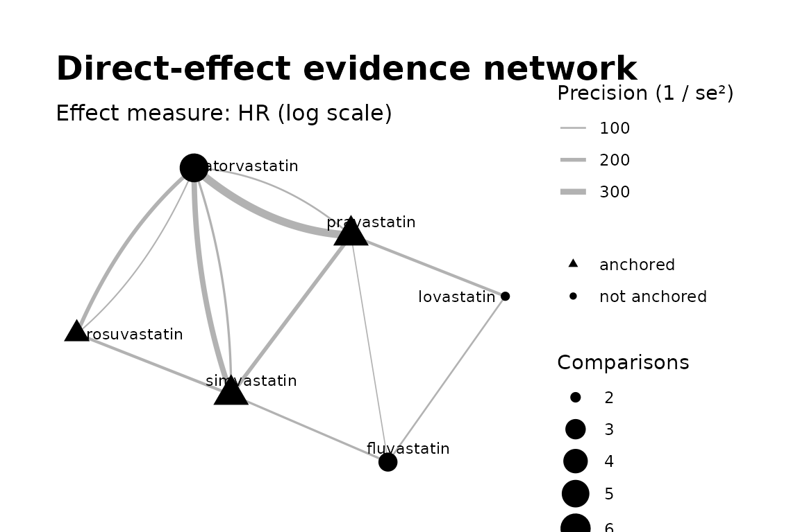
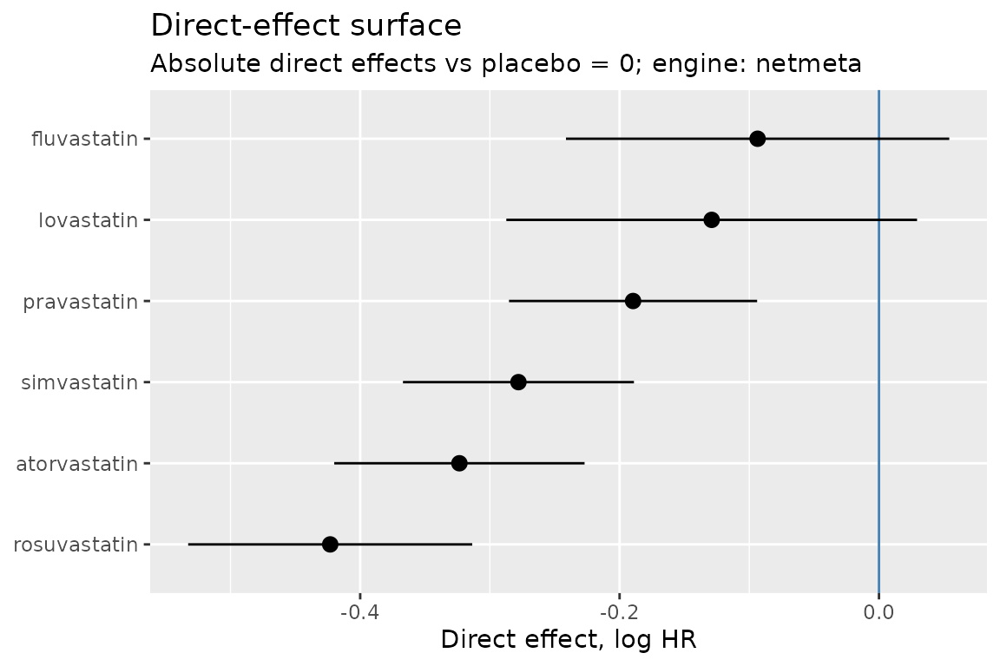
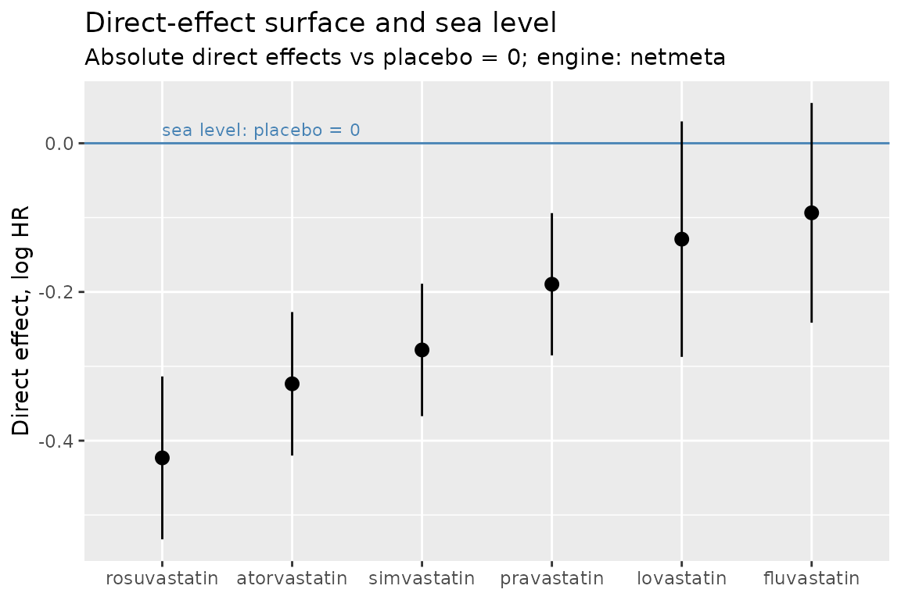

# Getting started with directeffect

## What directeffect is

Comparative-effectiveness studies mostly estimate *relative* effects:
drug A versus drug B from an active-comparator design. Each such
estimate constrains only the **difference** between the two drugs’
latent direct effects. The researcher ultimately wants each drug’s
*direct* effect versus placebo — and almost none of the evidence speaks
to that directly.

directeffect reconstructs the direct effects from the network of
comparative estimates, keeping two questions deliberately separate:

1.  **The surface.** Are my comparative estimates internally coherent,
    and what relative structure do they imply? Comparisons alone answer
    this.
2.  **The sea level.** Where does that structure sit relative to placebo
    = 0? Only absolute (placebo-anchored) evidence answers this.

The API mirrors the separation:
[`direct_effect_network()`](https://ablack3.github.io/directeffect/reference/direct_effect_network.md)
→
[`fit_surface()`](https://ablack3.github.io/directeffect/reference/fit_surface.md)
→
[`anchor_surface()`](https://ablack3.github.io/directeffect/reference/anchor_surface.md).

## The example data

The package ships a realistic but **entirely simulated** statin evidence
base — real drug names, fake numbers (see
[`?example_truth`](https://ablack3.github.io/directeffect/reference/example_truth.md)
for the invented truth they were generated from). Twelve head-to-head
estimates among six statins, plus three placebo-controlled anchor
trials, all log hazard ratios:

``` r

library(directeffect)

example_comparisons
#>           study_id       target   comparator estimate std_error
#> 1  rct_ator_simv_1 atorvastatin  simvastatin   -0.134      0.06
#> 2  rct_ator_simv_2 atorvastatin  simvastatin    0.105      0.09
#> 3  rct_ator_prav_1 atorvastatin  pravastatin   -0.132      0.05
#> 4  rct_ator_prav_2 atorvastatin  pravastatin   -0.174      0.10
#> 5  rct_rosu_ator_1 rosuvastatin atorvastatin   -0.165      0.07
#> 6  rct_rosu_ator_2 rosuvastatin atorvastatin   -0.050      0.11
#> 7  rct_rosu_simv_1 rosuvastatin  simvastatin   -0.086      0.08
#> 8  rct_simv_prav_1  simvastatin  pravastatin   -0.086      0.07
#> 9  rct_prav_lova_1  pravastatin   lovastatin   -0.029      0.08
#> 10 rct_lova_fluv_1   lovastatin  fluvastatin    0.014      0.10
#> 11 rct_simv_fluv_1  simvastatin  fluvastatin   -0.162      0.09
#> 12 rct_prav_fluv_1  pravastatin  fluvastatin   -0.207      0.12
example_anchors
#>        study_id         drug reference estimate std_error
#> 1 rct_simv_plac  simvastatin   placebo   -0.307      0.06
#> 2 rct_prav_plac  pravastatin   placebo   -0.219      0.07
#> 3 rct_rosu_plac rosuvastatin   placebo   -0.332      0.08
```

This is the shape real statin evidence has: most trials compare one
active drug against another, while a few landmark placebo trials carry
the absolute information. The input formats are documented in detail at
[`?directeffect_formats`](https://ablack3.github.io/directeffect/reference/directeffect_formats.md).

## 1. Build the network

Construction validates the tables and computes the evidence graph — no
model is fitted yet:

``` r

de <- direct_effect_network(
  example_comparisons,
  anchors = example_anchors,
  effect_measure = "HR"
)
de
#> <directeffect_network>
#>   Effect measure: HR (log scale)
#>   Drugs:          6
#>   Comparisons:    12
#>   Anchors:        3
#>   Components:     1
#> Use check_connectivity() for the per-component identifiability report.
```

Before fitting anything, inspect the evidence.
[`check_connectivity()`](https://ablack3.github.io/directeffect/reference/check_connectivity.md)
reports, per connected component, whether absolute effects are even
identifiable there — a component with no anchor supports relative
effects only, and the package will never pretend otherwise:

``` r

check_connectivity(de)
#> Component 1:
#>   6 drugs
#>   12 comparisons
#>   3 absolute anchors
#>   absolute effects identifiable
```

``` r

plot_network(de)
```



## 2. Fit the surface

Surface fitting deliberately ignores the anchors and fixes an arbitrary
reference drug at 0 — only relative positions are identified. Two
independent engines are available, `"netmeta"` (frequentist) and
`"stan"` (Bayesian); for networks with one comparison per study — like
this one — they fit the identical model, and they always return the
identical contract. (Multi-arm trials, several comparisons sharing a
`study_id`, are supported by the netmeta engine only; the Stan engine
refuses them rather than mis-treat correlated rows as independent.)

``` r

surface <- fit_surface(de, engine = "netmeta")
surface
#> <directeffect_fit>
#>   Engine:         netmeta
#>   Effect measure: HR (log scale)
#>   Reference:      atorvastatin (arbitrary; surface is relative)
#> 
#>          drug estimate std_error  lower  upper
#>  atorvastatin    0.000     0.000  0.000  0.000
#>   fluvastatin    0.230     0.070  0.092  0.368
#>    lovastatin    0.195     0.075  0.047  0.342
#>   pravastatin    0.134     0.039  0.058  0.209
#>  rosuvastatin   -0.100     0.049 -0.196 -0.003
#>   simvastatin    0.046     0.038 -0.030  0.121
```

## 3. Set the sea level

Anchoring is a distinct, revisable second step. The placebo trials
position the whole structure against placebo = 0 while keeping their own
uncertainty:

``` r

absolute <- anchor_surface(surface)
absolute
#> <directeffect_fit>
#>   Engine:         netmeta
#>   Effect measure: HR (log scale)
#>   Reference:      placebo = 0 (sea level; absolute direct effects)
#> 
#>          drug estimate std_error  lower  upper
#>  atorvastatin   -0.324     0.049 -0.420 -0.227
#>   fluvastatin   -0.094     0.075 -0.241  0.054
#>    lovastatin   -0.129     0.081 -0.287  0.029
#>   pravastatin   -0.190     0.049 -0.285 -0.094
#>  rosuvastatin   -0.423     0.056 -0.533 -0.314
#>   simvastatin   -0.278     0.045 -0.367 -0.189
```

`absolute$effects` is a plain data frame (schema at
[`?directeffect_formats`](https://ablack3.github.io/directeffect/reference/directeffect_formats.md))
ready for tables or further analysis.

``` r

plot_effect_surface(absolute)
```



``` r

plot_sea_level(absolute)
```



The same calls draw an unanchored fit too — but then the plot labels the
positions as relative to an arbitrary reference, never as absolute
effects, and
[`plot_sea_level()`](https://ablack3.github.io/directeffect/reference/plot_sea_level.md)
refuses outright: a relative surface has no sea level.

## 4. Check the evidence

Two quick diagnostics ask whether the comparative estimates actually
agree with one another:

``` r

edge_residuals(surface)
#>          target   comparator observed   predicted     residual
#> 1  atorvastatin  simvastatin   -0.134 -0.04552752 -0.088472478
#> 2  atorvastatin  simvastatin    0.105 -0.04552752  0.150527522
#> 3  atorvastatin  pravastatin   -0.132 -0.13390032  0.001900324
#> 4  atorvastatin  pravastatin   -0.174 -0.13390032 -0.040099676
#> 5  rosuvastatin atorvastatin   -0.165 -0.09962052 -0.065379480
#> 6  rosuvastatin atorvastatin   -0.050 -0.09962052  0.049620520
#> 7  rosuvastatin  simvastatin   -0.086 -0.14514804  0.059148042
#> 8   simvastatin  pravastatin   -0.086 -0.08837280  0.002372802
#> 9   pravastatin   lovastatin   -0.029 -0.06062088  0.031620877
#> 10   lovastatin  fluvastatin    0.014 -0.03540762  0.049407620
#> 11  simvastatin  fluvastatin   -0.162 -0.18440130  0.022401299
#> 12  pravastatin  fluvastatin   -0.207 -0.09602850 -0.110971504
#>    standardized_residual  leverage
#> 1            -1.92054499 0.4105256
#> 2             1.84977026 0.1824558
#> 3             0.05957327 0.5929831
#> 4            -0.43449393 0.1482458
#> 5            -1.31853456 0.4982310
#> 6             0.50489689 0.2017630
#> 7             0.99646417 0.4494746
#> 8             0.04354059 0.3939082
#> 9             0.73954227 0.7143450
#> 10            0.73954227 0.5536641
#> 11            0.37070201 0.5491714
#> 12           -1.10945703 0.3052325

cycle_consistency(surface)
#>                                                                  cycle n_edges
#> 1                 fluvastatin - pravastatin - lovastatin - fluvastatin       3
#> 2 fluvastatin - pravastatin - atorvastatin - simvastatin - fluvastatin       4
#> 3               pravastatin - atorvastatin - simvastatin - pravastatin       3
#> 4             rosuvastatin - atorvastatin - simvastatin - rosuvastatin       3
#>   inconsistency  std_error           z
#> 1   0.192000000 0.17549929  1.09402153
#> 2   0.124938462 0.16429336  0.76045960
#> 3  -0.006061538 0.09691392 -0.06254559
#> 4  -0.106314480 0.11126525 -0.95550484
```

*Validating the surface* covers these in depth.

## Where next

- *How directeffect works* explains the method from scratch — no
  background beyond basic statistics assumed — and checks the package
  against the example data’s known truth.
- *netmeta vs. Stan* shows the same surface reconstructed by two
  independent engines — the package’s built-in correctness check.
- *Validating the surface* covers edge residuals, cycle consistency, and
  simulation-based recovery.
