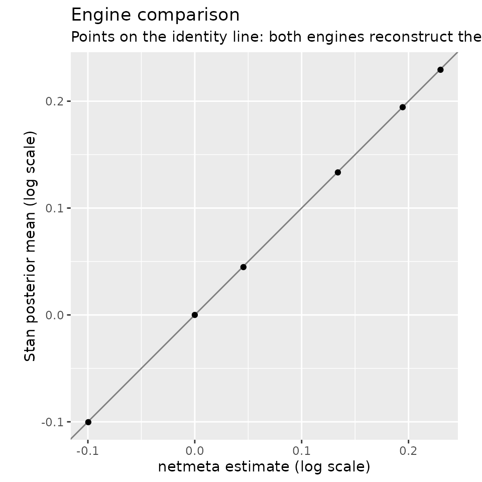

# netmeta vs. Stan: two engines, one surface

The v0.1 goal of directeffect, verbatim from its design: *demonstrate
that the same direct-effect surface is reconstructed independently by
netmeta and Stan.* For networks with one comparison per study — the
example data here included — both engines fit the identical
common-effect model

``` math
y_k \sim N(\theta_{\text{target}[k]} - \theta_{\text{comparator}[k]},\; se_k^2)
```

— netmeta by frequentist network meta-analysis, Stan by MCMC under a
deliberately weak `normal(0, 5)` prior so the comparison is meaningful.
If two independent implementations agree, an error in either would have
to be an error in both. (Multi-arm trials, whose comparisons are
correlated within a study, are the one place the engines differ: netmeta
models that correlation, and the Stan engine refuses such networks
rather than treat the rows as independent.)

## Fit both engines

Both engines sit behind the same
[`fit_surface()`](https://ablack3.github.io/directeffect/reference/fit_surface.md)
seam and return the same fit contract; downstream code cannot tell them
apart except via the `engine` field.

``` r

library(directeffect)

de <- direct_effect_network(
  example_comparisons,
  anchors = example_anchors,
  effect_measure = "HR"
)

fit_nm <- fit_surface(de, engine = "netmeta")
fit_st <- fit_surface(de, engine = "stan", seed = 731, refresh = 0)

fit_nm$effects[, c("drug", "estimate", "std_error")]
#>           drug    estimate  std_error
#> 1 atorvastatin  0.00000000 0.00000000
#> 2  fluvastatin  0.22992882 0.07026365
#> 3   lovastatin  0.19452120 0.07541296
#> 4  pravastatin  0.13390032 0.03850270
#> 5 rosuvastatin -0.09962052 0.04940984
#> 6  simvastatin  0.04552752 0.03844337
```

The Stan fit carries the same core columns plus posterior summaries and
convergence diagnostics:

``` r

fit_st$effects[, c("drug", "estimate", "sd", "rhat", "ess_bulk")]
#>           drug    estimate         sd      rhat ess_bulk
#> 1 atorvastatin  0.00000000 0.00000000        NA       NA
#> 2  fluvastatin  0.22939016 0.07155710 1.0001064     2914
#> 3   lovastatin  0.19436583 0.07533299 1.0003559     2985
#> 4  pravastatin  0.13336271 0.03837516 0.9999249     3035
#> 5 rosuvastatin -0.10032306 0.04913975 1.0002153     3373
#> 6  simvastatin  0.04475789 0.03848370 0.9999490     3351
```

## Compare

[`compare_engines()`](https://ablack3.github.io/directeffect/reference/compare_engines.md)
lines the two fits up per drug:

``` r

comparison <- compare_engines(fit_nm, fit_st)
comparison
#>           drug     netmeta   stan_mean    difference standardized_difference
#> 1 atorvastatin  0.00000000  0.00000000  0.0000000000                      NA
#> 2  fluvastatin  0.22992882  0.22939016 -0.0005386573            -0.005371180
#> 3   lovastatin  0.19452120  0.19436583 -0.0001553687            -0.001457582
#> 4  pravastatin  0.13390032  0.13336271 -0.0005376153            -0.009889737
#> 5 rosuvastatin -0.09962052 -0.10032306 -0.0007025431            -0.010081647
#> 6  simvastatin  0.04552752  0.04475789 -0.0007696346            -0.014148824
```

``` r

plot_engine_comparison(fit_nm, fit_st)
```



Points on the identity line mean the engines reconstruct the same
surface. The differences here are Monte Carlo noise plus the negligible
shrinkage of the weak prior — both far below anything of scientific
consequence.

## Continuously enforced

This is not just a vignette exercise: the package’s test suite simulates
a network under the model’s own assumptions and requires every per-drug
difference between the engines’ estimates to stay below 0.02 on the log
scale — and every difference between their standard errors below 0.01 —
on surface and anchored fits alike, on every commit, in CI. The two
implementations validate each other’s uncertainty as well as their point
estimates.

Anchoring works on either engine as well — the Bayesian path refits with
a separate anchored Stan model in which the anchors (not an arbitrary
constraint) identify the absolute location, while the frequentist path
applies a precision-weighted location offset:

``` r

absolute_nm <- anchor_surface(fit_nm)
absolute_st <- anchor_surface(fit_st, seed = 731, refresh = 0)

data.frame(
  drug = absolute_nm$effects$drug,
  netmeta = round(absolute_nm$effects$estimate, 3),
  stan = round(absolute_st$effects$estimate, 3)
)
#>           drug netmeta   stan
#> 1 atorvastatin  -0.324 -0.323
#> 2  fluvastatin  -0.094 -0.101
#> 3   lovastatin  -0.129 -0.135
#> 4  pravastatin  -0.190 -0.196
#> 5 rosuvastatin  -0.423 -0.401
#> 6  simvastatin  -0.278 -0.284
```
