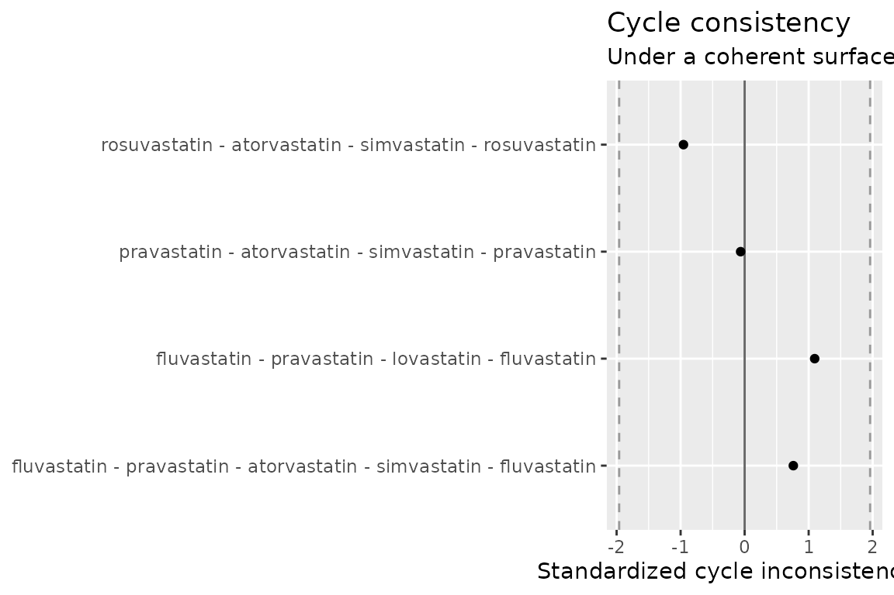

# Validating the surface

Diagnostics matter more than sophisticated estimation. Before trusting a
fitted surface — let alone an anchored one — ask whether the comparative
estimates are internally coherent, and whether the estimator would
recover a truth you control.

``` r

library(directeffect)

de <- direct_effect_network(
  example_comparisons,
  anchors = example_anchors,
  effect_measure = "HR"
)
fit <- fit_surface(de, engine = "netmeta")
```

## Edge residuals

For every comparison: the observed effect, the effect the fitted surface
predicts (`theta_target - theta_comparator`), and their difference
standardized by the residual’s actual standard deviation — which is
smaller than the comparison’s standard error, because the prediction is
partly built from the observation itself. The `leverage` column says how
much (at leverage 1, a *bridge* comparison nothing else can corroborate,
the standardized residual is reported as `NA` rather than as a falsely
reassuring 0; this network has no bridges). Large standardized residuals
mark comparisons that conflict with the rest of the network.

``` r

residuals <- edge_residuals(fit)
residuals[order(-abs(residuals$standardized_residual)), ][1:5, ]
#>          target   comparator observed   predicted    residual
#> 1  atorvastatin  simvastatin   -0.134 -0.04552752 -0.08847248
#> 2  atorvastatin  simvastatin    0.105 -0.04552752  0.15052752
#> 5  rosuvastatin atorvastatin   -0.165 -0.09962052 -0.06537948
#> 12  pravastatin  fluvastatin   -0.207 -0.09602850 -0.11097150
#> 7  rosuvastatin  simvastatin   -0.086 -0.14514804  0.05914804
#>    standardized_residual  leverage
#> 1             -1.9205450 0.4105256
#> 2              1.8497703 0.1824558
#> 5             -1.3185346 0.4982310
#> 12            -1.1094570 0.3052325
#> 7              0.9964642 0.4494746
```

## Cycle consistency

Around any closed loop of comparisons, the observed effects must sum to
zero if they are mutually consistent — walking A→B→C→A has to bring you
back to the same height.
[`cycle_consistency()`](https://ablack3.github.io/directeffect/reference/cycle_consistency.md)
evaluates a *cycle basis* (every cycle in the network is a combination
of basis cycles), so nothing is enumerated exhaustively; repeat
comparisons of a pair are pooled by precision first.

``` r

cycles <- cycle_consistency(fit)
cycles
#>                                                                  cycle n_edges
#> 1                 fluvastatin - pravastatin - lovastatin - fluvastatin       3
#> 2 fluvastatin - pravastatin - atorvastatin - simvastatin - fluvastatin       4
#> 3               pravastatin - atorvastatin - simvastatin - pravastatin       3
#> 4             rosuvastatin - atorvastatin - simvastatin - rosuvastatin       3
#>   inconsistency  std_error           z
#> 1   0.192000000 0.17549929  1.09402153
#> 2   0.124938462 0.16429336  0.76045960
#> 3  -0.006061538 0.09691392 -0.06254559
#> 4  -0.106314480 0.11126525 -0.95550484
```

``` r

plot_cycle_consistency(fit)
```



An inconsistency announces itself. Inject one — flip a single comparison
by 0.5 on the log scale — and both diagnostics flag it:

``` r

broken <- example_comparisons
broken$estimate[3] <- broken$estimate[3] + 0.5
fit_broken <- fit_surface(
  direct_effect_network(broken, effect_measure = "HR"),
  engine = "netmeta"
)

max(abs(edge_residuals(fit_broken)$standardized_residual))
#> [1] 6.439361
max(abs(cycle_consistency(fit_broken)$z))
#> [1] 4.18992
```

## Recovery from known truth

The strongest oracle needs no real data at all: simulate a network where
the truth is known, fit it, and measure recovery.
[`simulate_direct_effect_network()`](https://ablack3.github.io/directeffect/reference/simulate_direct_effect_network.md)
retains the generating truth, and
[`validate_recovery()`](https://ablack3.github.io/directeffect/reference/validate_recovery.md)
reports bias, RMSE, interval coverage, and rank correlation from the fit
contract alone — it works identically for either engine.

``` r

simulation <- simulate_direct_effect_network(
  n_drugs = 20, n_comparisons = 80, n_anchors = 3,
  heterogeneity = 0, seed = 42, se_range = c(0.03, 0.08)
)
recovered <- fit_surface(simulation$network, engine = "netmeta")
validate_recovery(recovered, simulation)
#> $bias
#> [1] -0.01355662
#> 
#> $rmse
#> [1] 0.0188893
#> 
#> $coverage
#> [1] 0.9473684
#> 
#> $rank_correlation
#> [1] 0.9982456
#> 
#> $n_drugs
#> [1] 19
#> 
#> $reference
#> [1] "drug_01"
```

In the low-noise regime the bias is near zero and coverage is near
nominal; the package’s test suite pins both down permanently. Together
the three oracles — hand-computable examples, cross-engine agreement
(see *netmeta vs. Stan*), and simulation truth — are what let the
surface be trusted.
